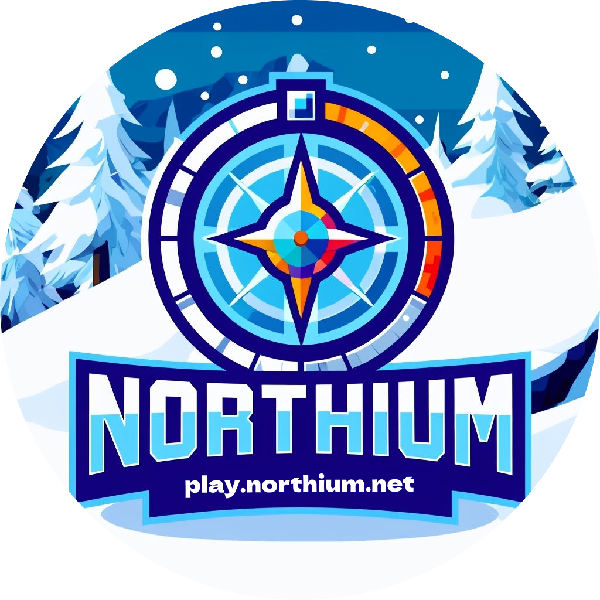

<h1 align="center">Northium Launcher</h1>

<em><h5 align="center">(powered by Helios Launcher)</h5></em>

[
](https://github.com/northiumnetwork/NorthiumLauncher/actions)  

Join Northium without worrying about installing Java, Forge, or other mods. We'll handle that for you.

## Features

* 🔒 Full account management.
  * Add multiple accounts and easily switch between them.
  * Microsoft (OAuth 2.0) + Mojang (Yggdrasil) authentication fully supported.
  * Credentials are never stored and transmitted directly to Mojang.
* 📂 Efficient asset management.
  * Receive client updates as soon as we release them.
  * Files are validated before launch. Corrupt or incorrect files will be redownloaded.
* ☕ **Automatic Java validation.**
  * If you have an incompatible version of Java installed, we'll install the right one *for you*.
  * You do not need to have Java installed to run the launcher.
* 📰 News feed natively built into the launcher.
* ⚙️ Intuitive settings management, including a Java control panel.
* Supports all of our servers.
  * Switch between server configurations with ease.
  * View the player count of the selected server.
* Automatic updates. That's right, the launcher updates itself.
*  View the status of Mojang's services.

## Downloads

You can download from [GitHub Releases](https://github.com/northiumnetwork/NorthiumNetwork/releases)

**Supported Platforms**

If you download from the [Releases](https://github.com/northiumnetwork/NorthiumNetwork/releases) tab, select the installer for your system.

| Platform | File |
| -------- | ---- |
| Windows x64 | `Northium-Launcher-setup-VERSION.exe` |
| macOS x64 | `Northium-Launcher-setup-VERSION-x64.dmg` |
| macOS arm64 | `Northium-Launcher-setup-VERSION-arm64.dmg` |
| Linux x64 | `Northium-Launcher-setup-VERSION.AppImage` |

### See you ingame.
